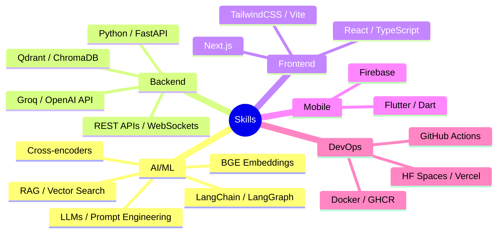

# 👋 Hi, I'm Muhammad Haris

### AI Engineer | Full-Stack Developer | Open Source Contributor

---

## 🚀 About Me

I build production-grade AI and software systems. My expertise spans **Retrieval-Augmented Generation (RAG)**, **LLM applications**, **full-stack development**, and **Flutter mobile apps**. I focus on creating scalable, zero-cost architectures that deliver real value.

- 🔭 **Current:** Building a production RAG system with LangGraph, Qdrant Cloud & Groq
- 🌱 **Learning:** Advanced LangGraph patterns, distributed systems
- 👯 **Open to:** Collaborations on AI/ML and full-stack projects
- 💬 **Ask me about:** RAG systems, Python, React, Flutter, FastAPI

---

## 🛠️ Tech Stack

---

## 📌 Pinned Projects

### [🔗 Production RAG System](https://github.com/Haris-Ahmed83/production-rag-system)
End-to-end RAG pipeline: upload documents → hybrid search → Groq LLM → citation-backed answers.
*LangChain, LangGraph, Qdrant Cloud, Groq, FastAPI, React*

### [🔗 Free LLM API](https://github.com/Haris-Ahmed83/freellmapi)
Free LLM API proxy/aggregator for multiple providers.
*Python, API Gateway, Rate Limiting*

### [🔗 AI Paper Summarizer](https://github.com/Haris-Ahmed83/AI-Paper-Summarizer)
Summarize academic papers using AI.
*Python, NLP, Transformers*

---

## 📊 GitHub Activity

---

## 🏆 Featured Achievement

### Production RAG System — $0/month, 95%+ Accuracy

| Metric | Value |
|--------|-------|
| Vector DB | Qdrant Cloud (persistent) |
| Search | Hybrid (Dense + BM25) + RRF |
| Reranker | Cross-encoder (graceful fallback) |
| LLM | Groq (llama-3.1-8b, 2-key failover) |
| Cost | $0/month (all free tiers) |
| Accuracy | 95%+ on complex multi-doc queries |

---

## 📫 Let's Connect

- **Portfolio:** [haris.primevoai.com](https://haris.primevoai.com)
- **LinkedIn:** [linkedin.com/in/muhammadharis-tech](https://www.linkedin.com/in/muhammadharis-tech/)
- **Email:** [haris1.tech@gmail.com](mailto:haris1.tech@gmail.com)

---

<i>"Building AI systems that don't cost a fortune."</i>

